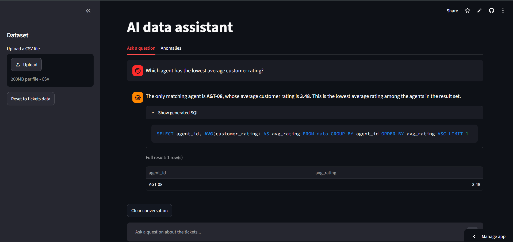
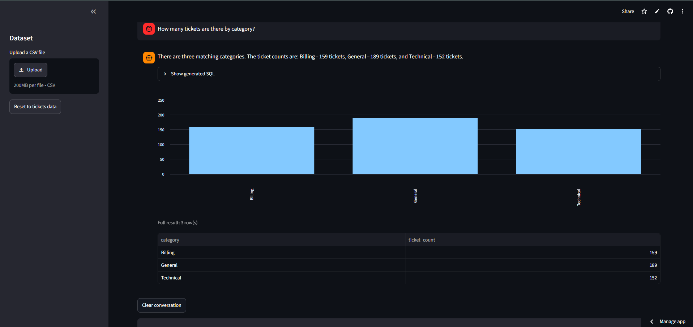
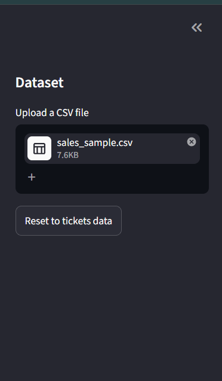

# AI Support Ticket Assistant

An AI-powered system for querying and monitoring a customer support ticket
dataset in natural language, built for the DOTMappers AI Engineer assessment.
It also works with any CSV you upload.

**Live demo:**https://ai-ticket-assistant-url.streamlit.app/
## What it does

- Loads a 500-row support ticket CSV into a queryable SQLite database by
  default, or **any CSV you upload** (the schema is generated automatically
  from its columns)
- Answers natural language questions (e.g. "Which agent has the lowest
  average customer rating?"), including **follow-up questions** such as
  "Only the open ones"
- Shows **bar and line charts** automatically for grouped results
- Detects and flags anomalies for the ticket data: abnormally long
  resolution times, and unresolved High/Critical priority tickets open more
  than 24 hours
- Exposes everything through a REST API (FastAPI) and a chat-style web
  UI (Streamlit)

## Screenshots

**Ask questions in plain English** (the generated SQL is shown under every answer)



**Charts are drawn automatically for grouped results**



**Upload any CSV and ask questions about it**



## Setup instructions

**Requirements:** Python 3.11+ (pandas 3 needs it), a free Groq API key.

1. Clone the repo and move into it:
   ```
   git clone <your-repo-url>
   cd ai-ticket-assistant
   ```

2. Create an environment and install dependencies (using
   [uv](https://docs.astral.sh/uv/)):
   ```
   uv venv --python 3.12
   .venv\Scripts\activate          (Windows)
   source .venv/bin/activate       (Mac/Linux)
   uv pip install -r requirements.txt
   ```

3. Get a free Groq API key at https://console.groq.com (Sign up ->
   API Keys -> Create API Key).

4. Copy `.env.example` to `.env` and paste your key in:
   ```
   cp .env.example .env
   ```
   Then edit `.env` so it looks like:
   ```
   GROQ_API_KEY=your_actual_key_here
   ```

5. Start everything with a single command:
   ```
   python run.py
   ```
   This starts the FastAPI backend on `http://127.0.0.1:8000`, waits for
   it to become healthy, then launches the Streamlit UI (opens
   automatically in your browser). Press Ctrl+C once to stop both.

   Alternatively, the two parts can be run separately if preferred:
   ```
   uvicorn app.main:app --reload
   streamlit run streamlit_app.py
   ```

## Using your own data

In the Streamlit sidebar, use **Upload a CSV file**. The new file replaces
the current dataset, the schema is rebuilt from its columns, and you can
start asking questions about it right away. The Anomalies tab is shown only
for the support-ticket data. Click **Reset to tickets data** to go back to
the default dataset (it is also reloaded whenever the API restarts).

## Running the tests

```
python -m pytest -v
```

13 tests cover the SQL safety check and the anomaly rules. They use a
temporary database, so your real data is never touched.

## Architecture overview

```
support_tickets.csv  (or an uploaded CSV)
        |
        v
   SQLite database  <-------------------+
        |                                |
        v                                |
   FastAPI backend  ------->  Groq LLM (NL question -> SQL)
   (/health, /query,          openai/gpt-oss-120b
    /anomalies, /upload,
    /reset, /dataset)
        |
        v
  Streamlit chat UI  (calls the API, renders answers, charts, full data tables)
```

**Design decisions and why:**

- **SQLite as the data layer.** The CSV is loaded into SQLite (`app/db.py`),
  rather than querying the CSV/pandas directly. This makes the data
  genuinely "queryable" via SQL, and scales the same way whether the table
  has 500 rows or 5 million. The default tickets CSV is loaded on every API
  startup; an uploaded CSV replaces it until the next reset or restart.

- **Schema generated from the data.** `get_schema_description()` reads the
  real columns and types from SQLite, and for short text columns (10 or
  fewer distinct values) it lists the allowed values so the LLM uses exact
  spellings (e.g. 'Open', not 'open'). Date-like columns are detected and
  converted automatically. This is what lets any CSV work without code
  changes.

- **Two-step LLM pipeline for NL queries**, kept deliberately separate:
  1. `question_to_sql()` - the LLM sees only the table schema (never the
     raw data rows) and writes one SQL SELECT statement.
  2. The backend executes that SQL itself against SQLite - the real
     answer comes from the database, not the LLM's memory.
  3. `format_answer()` - the LLM sees the actual query result and writes
     a short natural-language sentence.

  This means the LLM's job is strictly "understand the question, write a
  query, describe the result" - it never gets a chance to invent a
  number. This was a specific requirement in the assessment brief, and
  the architecture enforces it structurally rather than just hoping the
  LLM behaves.

- **Conversation memory.** The UI sends the last 3 questions and the SQL
  they produced along with each new question, so the LLM can resolve
  follow-ups like "only the open ones". Only the questions and SQL are
  sent, not the answers or result rows, which keeps it cheap and keeps the
  "LLM never sees raw data" property.

- **Anomaly detection is NOT done by the LLM.** Both anomaly rules
  (`app/anomalies.py`) are plain Python/pandas: a per-category
  mean + 2*std threshold for long resolution times, and a simple
  status/priority/age filter for unresolved high-priority tickets.
  Statistical thresholds are something code can compute exactly and an
  LLM can't reliably reconstruct on demand - so anomaly questions are
  routed (via a keyword check) to these trusted rules instead of the
  NL-to-SQL path, and the LLM's only job there is to summarize the
  (already correct) result. The rules run only when the loaded data has the
  support-ticket columns.

- **A single reference "now" for the whole dataset.** This is a static
  historical dataset (Jan-Mar 2024), so comparing against the real
  wall-clock date would make every relative-time question ("this week",
  "unresolved for 24 hours") behave nonsensically. `db.get_reference_now()`
  returns the latest timestamp in the first date column of the data, and
  every module (anomaly rules, LLM prompts) treats that as "now" instead of
  the real current date. A dataset with no date column simply has no
  reference "now".

- **Layered safety for generated SQL.** LLM-written SQL goes through three
  layers:
  1. A text check that allows only a single `SELECT` / `WITH` statement and
     blocks write, schema and `PRAGMA` keywords. Keywords are matched as
     whole words outside quoted text, so a filter like `LIKE '%update%'`
     is not wrongly blocked.
  2. Execution on a **read-only SQLite connection** (`mode=ro`), so the
     database itself refuses any write even if the text check were bypassed.
  3. One automatic retry: if the SQL fails, the error is sent back to the
     LLM once to fix the query.

- **Full result tables are rendered from the database, not the LLM.** The
  API returns the complete matching row set alongside the LLM's short
  summary sentence. The UI displays that data directly, and draws a bar
  chart (text labels) or line chart (date labels) when the result is a
  small label + numbers table. Early versions had the LLM try to list every
  matching row itself, which was both wasteful (extra tokens) and
  unreliable (it would sometimes miscount rows when summarizing a partial
  sample) - this was found and fixed during testing (see Known limitations).

## Model and tools used

| Component | Tool |
|---|---|
| Language | Python 3.11+ |
| Environment | uv |
| Database | SQLite (via `sqlite3` + `pandas`) |
| LLM | Groq free tier, model `openai/gpt-oss-120b` |
| REST API | FastAPI + Uvicorn |
| UI | Streamlit (chat interface, charts, CSV upload) |
| LLM client | `groq` Python SDK |
| Tests | pytest |

`openai/gpt-oss-120b` was chosen after checking which models were
actually available on a free-tier Groq account (some models, like
`llama-3.3-70b-versatile`, returned a 404 for this account tier). It's a
reasoning model, which required two adjustments: `reasoning_effort="low"`
and a higher `max_tokens` ceiling, because reasoning models can otherwise
spend their whole token budget on internal reasoning and return an empty
final answer.

## Example queries and outputs

**Q: "How many tickets are currently open?"**
> There are currently 111 open tickets.

**Q: "Which agent has the lowest average customer rating?"**
> The agent with the lowest average customer rating is AGT-08, with an
> average rating of 3.48.

**Q: "Show me all Critical tickets not resolved within 12 hours."**
> Total matching tickets: 34. Criteria: Priority = Critical and the
> ticket was not resolved within 12 hours (either still unresolved or
> resolved after more than 12 hours).
*(Full 34-row table also rendered below the answer in the UI.)*

**Q: "Which agent resolved the most tickets this month?"**
> The agent who resolved the most tickets this month is AGT-01, with 16
> tickets resolved.
*("This month" is resolved relative to the dataset's own latest date,
not the real calendar month.)*

**Q: "Are there any anomalies in resolution times this week?"**
> [Summarizes the tickets flagged by the long-resolution-time rule whose
> creation date falls in the last 7 days of the dataset's timeline.]

**Follow-up questions:** ask "How many tickets are there by category?"
(a bar chart is drawn), then "Only the open ones" - the second question is
understood in the context of the first.

## Known limitations

- **Anomaly rules are specific to the ticket data.** Schema generation and
  question answering work with any uploaded CSV, but the two anomaly rules
  are written for the support-ticket columns, so the Anomalies tab is
  hidden for other datasets. A more general version would offer
  configurable rules, for example flagging numeric outliers in any column.

- **One dataset at a time.** Uploading a CSV replaces the current data
  rather than adding a second table, and the default tickets data is
  reloaded when the API restarts.

- **Anomaly routing is keyword-based.** A question containing words like
  "anomaly" or "unusual" is sent to the anomaly rules, which can only
  filter by time ("today", "this week", "this month"), not by category,
  agent or priority.

- **"Relative time" is dataset-relative, not wall-clock.** Since this is
  a static historical snapshot, "today"/"this week"/"this month" are
  interpreted relative to the latest timestamp in the data, not the real
  current date. This is the correct behavior for a snapshot dataset, but
  would need to switch to `datetime.now()` for a live, continuously
  updated ticket system.

- **LLM count accuracy required extra guardrails.** Early testing showed
  the LLM would sometimes miscount rows when writing a summary sentence
  (e.g. reporting 30 instead of the correct 34) if the true count wasn't
  stated unambiguously in the prompt. Fixed by explicitly labeling the
  total count as its own field in the prompt, separate from the sampled
  row data, and instructing the LLM not to count rows itself.

- **Short conversation memory.** Only the last 3 questions (with their SQL)
  are remembered, and anomaly answers are not part of that memory.

- **Free-tier rate limits.** Groq's free tier has request-per-minute
  limits; heavy concurrent use could hit them. Not an issue for this
  assessment's scale.

## What I'd improve with more time

- Containerize with Docker for a true one-command, environment-independent setup
- Let anomaly questions use filters (category, agent, priority) and add a generic numeric-outlier rule for uploaded data
- Support several uploaded tables at once and let the user pick which one to query
- Add an accuracy evaluation: a set of benchmark questions with known answers, to measure how often the generated SQL is correct
- Add a CI workflow that runs the tests on every push